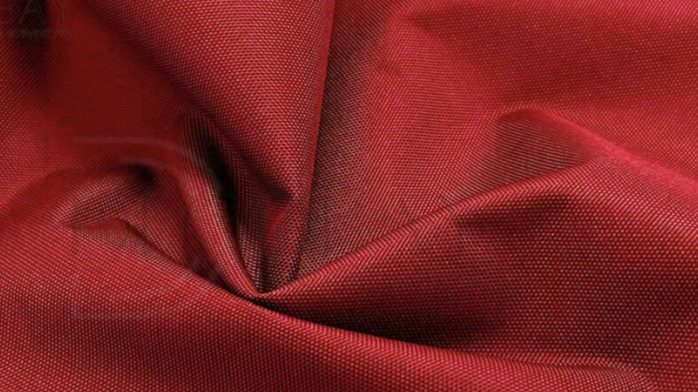

<html lang="ru">
<head>
    <meta charset="UTF-8">
    <meta name="viewport" content="width=device-width, initial-scale=1.0">
    <title>DAKTRA — Оптовая торговля техническими тканями</title>
    <link rel="stylesheet" href="https://cdnjs.cloudflare.com/ajax/libs/font-awesome/6.0.0/css/all.min.css">
    
</head>
<body>

    
<i class="fa fa-map-marker-alt"></i> Минск, Республика Беларусь

    

        <i class="fa fa-phone"></i> +375 44 506 34 72
        <a href="#"><i class="fab fa-whatsapp"></i> WhatsApp</a>
        <a href="#"><i class="fa fa-envelope"></i> daktra_a.s@mail.ru</a>
    

<header class="main-header">
    
    
    <nav class="nav-menu">
        <a href="#">Каталог</a>
        <a href="#">О компании</a>
        <a href="#">Доставка</a>
        <a href="#">Опт</a>
        <a href="#">Контакты</a>
    </nav>

    

        <input type="text" placeholder="Поиск по артикулу...">
        <button><i class="fa fa-search"></i></button>
    

</header>

<section class="hero">
    

        <h1>ТКАНИ ДЛЯ ВАШЕГО ПРОИЗВОДСТВА</h1>
        
Прямые поставки из Китая, Турции и России

        <a href="#calculator" class="btn-primary">Рассчитать заказ</a>
    

</section>

<section class="section-container">
    <h2 class="section-title">Хиты продаж</h2>
    

        

            
            
14.90 BYN

            
Оксфорд 600D PU1000 (Красный)

            
Ткань для тентов и рюкзаков

            <button style="width:100%; padding:10px; background:var(--graphite); color:white; border:none; cursor:pointer;">В корзину</button>
        

    

</section>

<section class="calc-section" id="calculator">
    

        <h2>Производственный калькулятор</h2>
        
        

            <label>Количество изделий (шт)</label>
            <input type="number" id="quantity" placeholder="Например: 1000" oninput="calculate()">
        

        
        

            <label>Расход на 1 изделие (метры)</label>
            <input type="number" id="consumption" step="0.1" placeholder="Например: 2.5" oninput="calculate()">
        

        
        

            <label>Ширина рулона (см)</label>
            <select id="width">
                <option value="150">150 см</option>
                <option value="180">180 см</option>
                <option value="220">220 см</option>
            </select>
        

        

            <label>Средний % отходов (выпады)</label>
            <input type="number" id="waste" value="7" oninput="calculate()">
        

        <button class="calc-btn" onclick="calculate()">Рассчитать метраж для закупа</button>

        

            Необходимый объем закупки: 
            0 м.п.
            

        

    

</section>

<section class="section-container">
    <h2 class="section-title">Новости и статьи</h2>
    

        

            
            

                
26 марта 2026

                <h4>Обновление сетки скидок от объема</h4>
                
Узнайте о новых условиях для крупных оптовых партий...

                <a href="#" class="read-more">Подробнее →</a>
            

        

        

            
            

                
20 марта 2026

                <h4>Как выбрать ткань для спецодежды?</h4>
                
Гайд по плотности, пропиткам и износостойкости материалов...

                <a href="#" class="read-more">Подробнее →</a>
            

        

    

</section>

<footer>
    

        <h4>ООО «ДАКТРА»</h4>
        <ul>
            <li>Прямые поставки тканей</li>
            <li>Работа с госзаказами</li>
            <li>Склады в Минске</li>
        </ul>
    

    

        <h4>Разделы</h4>
        <ul>
            <li><a href="#" style="color:white; text-decoration:none;">Каталог</a></li>
            <li><a href="#" style="color:white; text-decoration:none;">Оптовый прайс</a></li>
            <li><a href="#" style="color:white; text-decoration:none;">Сертификаты</a></li>
        </ul>
    

    

        <h4>Контакты</h4>
        <ul>
            <li>+375 44 506 34 72</li>
            <li>пн-пт: 9:00 — 18:00</li>
            <li>Минск, складской комплекс</li>
        </ul>
    

    

        © 2026 ООО «Дактра». Прототип B2B-портала для дипломного проекта.
    

</footer>

</body>
</html>
